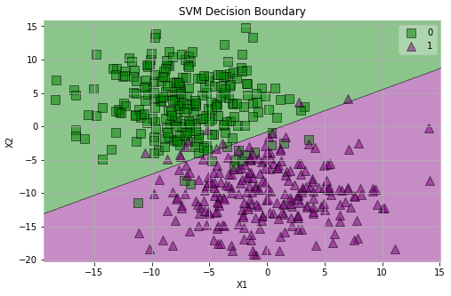
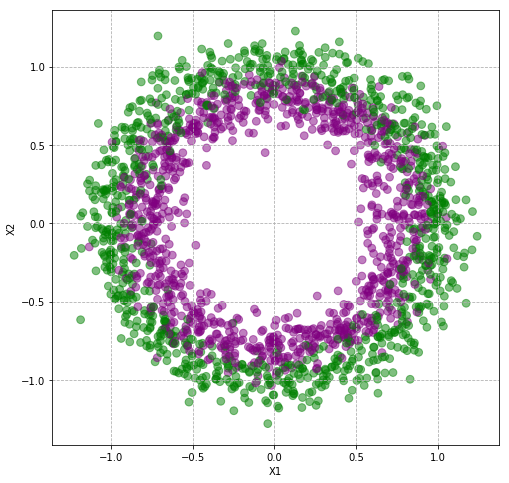
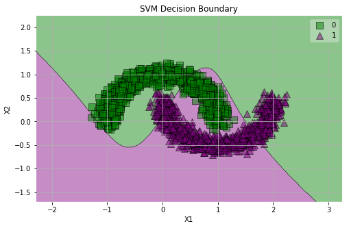
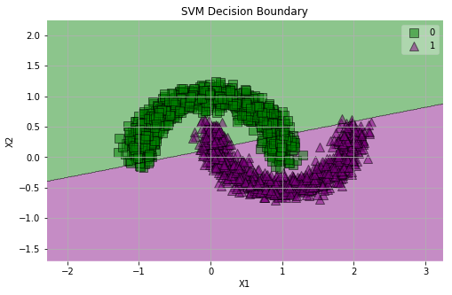
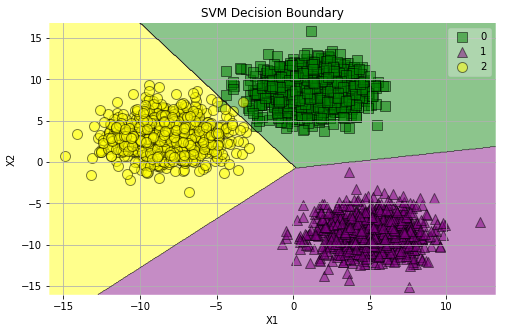

### Questions
- polynomial vs sigmoid kernels
- rbf (radial basis function) is a goto...why? see it more often and says it in the lab and lesson

### Objectives
YWBAT
* compare and contrast the various methods for SVMs
* implement SVMs using sklearn
* use model analysis to tailor SVM

### Outline
- Introduce dataset
- Go through various svm models and their use case
- Tweak SVMs to suit the problem

### When? Why?

SVMs are great to use anytime you want decisions to be made by using boundaries.  One example is finding points that are closest to the boundary and then using those points in your training set.  Boundaries are very helpful for classification, but also helpful for finding training points. 

Build a model
- classify new points and evaluate our classification
- if points weren't classified correctly we took their distance from the mislabeled class boundary 
- add those points to our training set


```python
import pandas as pd
import numpy as np

from sklearn.datasets import make_circles,  make_blobs, make_moons
from sklearn.svm import SVC, LinearSVC, NuSVC
from sklearn.metrics import confusion_matrix, precision_recall_fscore_support, accuracy_score, classification_report
from sklearn.model_selection import train_test_split
from mlxtend.plotting import plot_decision_regions

import matplotlib.pyplot as plt
import seaborn as sns
```


```python
def plot_groups(x, y):
    plt.figure(figsize=(8, 8))
    plt.grid(linestyle='dashed')
    color_dict = {0: 'g', 1: 'purple'}
    for data, label in zip(x, y):
        plt.scatter(data[0], data[1], c=color_dict[label], alpha=0.5, s=60)
    plt.xlabel("X1")
    plt.ylabel("X2")
    plt.show()
    

def plot_groups3(x, y):
    plt.figure(figsize=(8, 8))
    plt.grid(linestyle='dashed')
    color_dict = {0: 'g', 1: 'purple', 2: 'yellow'}
    for data, label in zip(x, y):
        plt.scatter(data[0], data[1], c=color_dict[label], alpha=0.5, s=60)
    plt.xlabel("X1")
    plt.ylabel("X2")
    plt.show()
    

    
def plot_svm_groups(x, y, clf):
    plt.figure(figsize=(8, 5))
    plt.grid()
    plot_decision_regions(x, y, clf, colors='green,purple,yellow', scatter_kwargs={"s": 100, "alpha": 0.5})
    plt.xlabel("X1")
    plt.ylabel("X2")
    plt.title("SVM Decision Boundary")
    plt.show()
    

def print_report(ytrain, ytest, ytrain_pred, ytest_pred):
    report = classification_report(ytrain, ytrain_pred)
    print("Train Scores\n" + "-"*50)
    print(report)
    accuracy = accuracy_score(ytrain, ytrain_pred)
    print(f"Train Accuracy: {accuracy}")
    report = classification_report(ytest, ytest_pred)
    print("Test Scores\n" + "-"*50)
    print(report)
    accuracy = accuracy_score(ytest, ytest_pred)
    print(f"Test Accuracy: {accuracy}")
```

## Linear SVM


```python
x, y = make_blobs(n_samples=500, n_features=2, centers=2, cluster_std=4.5)
```


```python
plot_groups(x, y)
```


```python
xtrain, xtest, ytrain, ytest = train_test_split(x, y)
```


```python
clf = LinearSVC()
clf.fit(xtrain, ytrain)
```

    /anaconda3/lib/python3.7/site-packages/sklearn/svm/base.py:929: ConvergenceWarning: Liblinear failed to converge, increase the number of iterations.
      "the number of iterations.", ConvergenceWarning)


    LinearSVC(C=1.0, class_weight=None, dual=True, fit_intercept=True,
              intercept_scaling=1, loss='squared_hinge', max_iter=1000,
              multi_class='ovr', penalty='l2', random_state=None, tol=0.0001,
              verbose=0)


```python
plot_svm_groups(x, y, clf)
```


```python
clf = LinearSVC()
clf.fit(xtrain, ytrain)
ytrain_pred = clf.predict(xtrain)
ytest_pred = clf.predict(xtest)
plot_svm_groups(x, y, clf)
print_report(ytrain, ytest, ytrain_pred, ytest_pred)
```

    /anaconda3/lib/python3.7/site-packages/sklearn/svm/base.py:929: ConvergenceWarning: Liblinear failed to converge, increase the number of iterations.
      "the number of iterations.", ConvergenceWarning)


    Train Scores
    --------------------------------------------------
                  precision    recall  f1-score   support
    
               0       0.97      0.96      0.96       184
               1       0.96      0.97      0.97       191
    
        accuracy                           0.97       375
       macro avg       0.97      0.97      0.97       375
    weighted avg       0.97      0.97      0.97       375
    
    Train Accuracy: 0.9653333333333334
    Test Scores
    --------------------------------------------------
                  precision    recall  f1-score   support
    
               0       0.98      0.98      0.98        66
               1       0.98      0.98      0.98        59
    
        accuracy                           0.98       125
       macro avg       0.98      0.98      0.98       125
    weighted avg       0.98      0.98      0.98       125
    
    Test Accuracy: 0.984


```python
clf = SVC(kernel='sigmoid')
clf.fit(xtrain, ytrain)
ytrain_pred = clf.predict(xtrain)
ytest_pred = clf.predict(xtest)
plot_svm_groups(x, y, clf)
print_report(ytrain, ytest, ytrain_pred, ytest_pred)
```

    /anaconda3/lib/python3.7/site-packages/sklearn/svm/base.py:193: FutureWarning: The default value of gamma will change from 'auto' to 'scale' in version 0.22 to account better for unscaled features. Set gamma explicitly to 'auto' or 'scale' to avoid this warning.
      "avoid this warning.", FutureWarning)


    Train Scores
    --------------------------------------------------
                  precision    recall  f1-score   support
    
               0       0.90      0.91      0.91       184
               1       0.92      0.91      0.91       191
    
        accuracy                           0.91       375
       macro avg       0.91      0.91      0.91       375
    weighted avg       0.91      0.91      0.91       375
    
    Train Accuracy: 0.9093333333333333
    Test Scores
    --------------------------------------------------
                  precision    recall  f1-score   support
    
               0       0.93      0.97      0.95        66
               1       0.96      0.92      0.94        59
    
        accuracy                           0.94       125
       macro avg       0.95      0.94      0.94       125
    weighted avg       0.94      0.94      0.94       125
    
    Test Accuracy: 0.944


```python
clf = SVC(kernel='poly')
clf.fit(xtrain, ytrain)
ytrain_pred = clf.predict(xtrain)
ytest_pred = clf.predict(xtest)
plot_svm_groups(x, y, clf)
print_report(ytrain, ytest, ytrain_pred, ytest_pred)
```

    /anaconda3/lib/python3.7/site-packages/sklearn/svm/base.py:193: FutureWarning: The default value of gamma will change from 'auto' to 'scale' in version 0.22 to account better for unscaled features. Set gamma explicitly to 'auto' or 'scale' to avoid this warning.
      "avoid this warning.", FutureWarning)





    Train Scores
    --------------------------------------------------
                  precision    recall  f1-score   support
    
               0       0.96      0.97      0.96       184
               1       0.97      0.96      0.96       191
    
        accuracy                           0.96       375
       macro avg       0.96      0.96      0.96       375
    weighted avg       0.96      0.96      0.96       375
    
    Train Accuracy: 0.9626666666666667
    Test Scores
    --------------------------------------------------
                  precision    recall  f1-score   support
    
               0       0.96      0.98      0.97        66
               1       0.98      0.95      0.97        59
    
        accuracy                           0.97       125
       macro avg       0.97      0.97      0.97       125
    weighted avg       0.97      0.97      0.97       125
    
    Test Accuracy: 0.968


```python
clf = SVC(kernel='rbf')
clf.fit(xtrain, ytrain)
ytrain_pred = clf.predict(xtrain)
ytest_pred = clf.predict(xtest)
plot_svm_groups(x, y, clf)
print_report(ytrain, ytest, ytrain_pred, ytest_pred)
```

    /anaconda3/lib/python3.7/site-packages/sklearn/svm/base.py:193: FutureWarning: The default value of gamma will change from 'auto' to 'scale' in version 0.22 to account better for unscaled features. Set gamma explicitly to 'auto' or 'scale' to avoid this warning.
      "avoid this warning.", FutureWarning)


    Train Scores
    --------------------------------------------------
                  precision    recall  f1-score   support
    
               0       0.99      0.97      0.98       184
               1       0.97      0.99      0.98       191
    
        accuracy                           0.98       375
       macro avg       0.98      0.98      0.98       375
    weighted avg       0.98      0.98      0.98       375
    
    Train Accuracy: 0.984
    Test Scores
    --------------------------------------------------
                  precision    recall  f1-score   support
    
               0       0.97      0.94      0.95        66
               1       0.93      0.97      0.95        59
    
        accuracy                           0.95       125
       macro avg       0.95      0.95      0.95       125
    weighted avg       0.95      0.95      0.95       125
    
    Test Accuracy: 0.952


```python
ytrain_pred = clf.predict(xtrain)
ytest_pred = clf.predict(xtest)
```


```python
print_report(ytrain, ytest, ytrain_pred, ytest_pred)
```

    Train Scores
    --------------------------------------------------
                  precision    recall  f1-score   support
    
               0       0.90      0.90      0.90       184
               1       0.90      0.90      0.90       191
    
        accuracy                           0.90       375
       macro avg       0.90      0.90      0.90       375
    weighted avg       0.90      0.90      0.90       375
    
    Train Accuracy: 0.8986666666666666
    Test Scores
    --------------------------------------------------
                  precision    recall  f1-score   support
    
               0       0.92      0.89      0.91        66
               1       0.89      0.92      0.90        59
    
        accuracy                           0.90       125
       macro avg       0.90      0.90      0.90       125
    weighted avg       0.90      0.90      0.90       125
    
    Test Accuracy: 0.904


```python
clf.coef_
clf.decision_function([[-1, 0]])
```


    array([0.40881214])


### Thoughts

- Training data is probably coming from the overlaps
- Testing data is probably from the outside of each group

## RBF SVM


```python
x, y = make_circles(n_samples=2000, shuffle=True, noise=0.05)
```


```python
plot_groups(x, y)
```


```python
xtrain, xtest, ytrain, ytest = train_test_split(x, y)
```

### Linear SVM


```python
clf = LinearSVC()
clf.fit(xtrain, ytrain)
ytrain_pred = clf.predict(xtrain)
ytest_pred = clf.predict(xtest)
plot_svm_groups(x, y, clf)
print_report(ytrain, ytest, ytrain_pred, ytest_pred)
```





    Train Scores
    --------------------------------------------------
                  precision    recall  f1-score   support
    
               0       0.53      0.37      0.44       746
               1       0.52      0.68      0.59       754
    
        accuracy                           0.52      1500
       macro avg       0.53      0.52      0.51      1500
    weighted avg       0.53      0.52      0.51      1500
    
    Train Accuracy: 0.5246666666666666
    Test Scores
    --------------------------------------------------
                  precision    recall  f1-score   support
    
               0       0.50      0.37      0.43       254
               1       0.49      0.62      0.54       246
    
        accuracy                           0.49       500
       macro avg       0.49      0.49      0.49       500
    weighted avg       0.49      0.49      0.48       500
    
    Test Accuracy: 0.492


### RBF


```python
clf = SVC(kernel='rbf')
clf.fit(xtrain, ytrain)
ytrain_pred = clf.predict(xtrain)
ytest_pred = clf.predict(xtest)
plot_svm_groups(x, y, clf)
print_report(ytrain, ytest, ytrain_pred, ytest_pred)
```

    /anaconda3/lib/python3.7/site-packages/sklearn/svm/base.py:193: FutureWarning: The default value of gamma will change from 'auto' to 'scale' in version 0.22 to account better for unscaled features. Set gamma explicitly to 'auto' or 'scale' to avoid this warning.
      "avoid this warning.", FutureWarning)


    Train Scores
    --------------------------------------------------
                  precision    recall  f1-score   support
    
               0       0.97      0.97      0.97       746
               1       0.97      0.97      0.97       754
    
        accuracy                           0.97      1500
       macro avg       0.97      0.97      0.97      1500
    weighted avg       0.97      0.97      0.97      1500
    
    Train Accuracy: 0.9713333333333334
    Test Scores
    --------------------------------------------------
                  precision    recall  f1-score   support
    
               0       0.98      0.97      0.97       254
               1       0.97      0.98      0.97       246
    
        accuracy                           0.97       500
       macro avg       0.97      0.97      0.97       500
    weighted avg       0.97      0.97      0.97       500
    
    Test Accuracy: 0.974


### Thoughts
- When do use this? 
- When the boundary isn't linear, when you cannot separate the data in the current dimensions. 

## Sigmoidal SVM


```python
x, y = make_moons(n_samples=2000, noise=0.10)
```


```python
plot_groups(x, y)
```


```python
xtrain, xtest, ytrain, ytest = train_test_split(x, y)
```


```python
clf = SVC(kernel='sigmoid')
clf.fit(xtrain, ytrain)
ytrain_pred = clf.predict(xtrain)
ytest_pred = clf.predict(xtest)
plot_svm_groups(x, y, clf)
print_report(ytrain, ytest, ytrain_pred, ytest_pred)
```

    /anaconda3/lib/python3.7/site-packages/sklearn/svm/base.py:193: FutureWarning: The default value of gamma will change from 'auto' to 'scale' in version 0.22 to account better for unscaled features. Set gamma explicitly to 'auto' or 'scale' to avoid this warning.
      "avoid this warning.", FutureWarning)


    Train Scores
    --------------------------------------------------
                  precision    recall  f1-score   support
    
               0       0.69      0.69      0.69       756
               1       0.68      0.69      0.68       744
    
        accuracy                           0.69      1500
       macro avg       0.69      0.69      0.69      1500
    weighted avg       0.69      0.69      0.69      1500
    
    Train Accuracy: 0.686
    Test Scores
    --------------------------------------------------
                  precision    recall  f1-score   support
    
               0       0.70      0.69      0.70       244
               1       0.71      0.72      0.72       256
    
        accuracy                           0.71       500
       macro avg       0.71      0.71      0.71       500
    weighted avg       0.71      0.71      0.71       500
    
    Test Accuracy: 0.706


### RBF


```python
clf = SVC(kernel='rbf')
clf.fit(xtrain, ytrain)
ytrain_pred = clf.predict(xtrain)
ytest_pred = clf.predict(xtest)
plot_svm_groups(x, y, clf)
print_report(ytrain, ytest, ytrain_pred, ytest_pred)
```

    /anaconda3/lib/python3.7/site-packages/sklearn/svm/base.py:193: FutureWarning: The default value of gamma will change from 'auto' to 'scale' in version 0.22 to account better for unscaled features. Set gamma explicitly to 'auto' or 'scale' to avoid this warning.
      "avoid this warning.", FutureWarning)


    Train Scores
    --------------------------------------------------
                  precision    recall  f1-score   support
    
               0       1.00      0.99      1.00       756
               1       0.99      1.00      1.00       744
    
        accuracy                           1.00      1500
       macro avg       1.00      1.00      1.00      1500
    weighted avg       1.00      1.00      1.00      1500
    
    Train Accuracy: 0.9953333333333333
    Test Scores
    --------------------------------------------------
                  precision    recall  f1-score   support
    
               0       1.00      0.99      0.99       244
               1       0.99      1.00      0.99       256
    
        accuracy                           0.99       500
       macro avg       0.99      0.99      0.99       500
    weighted avg       0.99      0.99      0.99       500
    
    Test Accuracy: 0.994


### Linear


```python
clf = LinearSVC()
clf.fit(xtrain, ytrain)
ytrain_pred = clf.predict(xtrain)
ytest_pred = clf.predict(xtest)
plot_svm_groups(x, y, clf)
print_report(ytrain, ytest, ytrain_pred, ytest_pred)
```





    Train Scores
    --------------------------------------------------
                  precision    recall  f1-score   support
    
               0       0.89      0.89      0.89       756
               1       0.88      0.89      0.89       744
    
        accuracy                           0.89      1500
       macro avg       0.89      0.89      0.89      1500
    weighted avg       0.89      0.89      0.89      1500
    
    Train Accuracy: 0.8866666666666667
    Test Scores
    --------------------------------------------------
                  precision    recall  f1-score   support
    
               0       0.89      0.89      0.89       244
               1       0.90      0.89      0.90       256
    
        accuracy                           0.89       500
       macro avg       0.89      0.89      0.89       500
    weighted avg       0.89      0.89      0.89       500
    
    Test Accuracy: 0.894


## Polynomial SVM


```python
clf = SVC(kernel='poly')
clf.fit(xtrain, ytrain)
ytrain_pred = clf.predict(xtrain)
ytest_pred = clf.predict(xtest)
plot_svm_groups(x, y, clf)
print_report(ytrain, ytest, ytrain_pred, ytest_pred)
```

    /anaconda3/lib/python3.7/site-packages/sklearn/svm/base.py:193: FutureWarning: The default value of gamma will change from 'auto' to 'scale' in version 0.22 to account better for unscaled features. Set gamma explicitly to 'auto' or 'scale' to avoid this warning.
      "avoid this warning.", FutureWarning)


    Train Scores
    --------------------------------------------------
                  precision    recall  f1-score   support
    
               0       0.99      0.87      0.93       756
               1       0.88      0.99      0.93       744
    
        accuracy                           0.93      1500
       macro avg       0.94      0.93      0.93      1500
    weighted avg       0.94      0.93      0.93      1500
    
    Train Accuracy: 0.9306666666666666
    Test Scores
    --------------------------------------------------
                  precision    recall  f1-score   support
    
               0       0.99      0.87      0.93       244
               1       0.89      0.99      0.94       256
    
        accuracy                           0.93       500
       macro avg       0.94      0.93      0.93       500
    weighted avg       0.94      0.93      0.93       500
    
    Test Accuracy: 0.932


###  Thoughts?


```python
x, y = make_blobs(n_samples=3000, n_features=2, centers=3, cluster_std=1.8)
plot_groups3(x, y)
```





## Let's try all types of SVMs


```python
xtrain, xtest, ytrain, ytest = train_test_split(x, y)
```

### Linear


```python
clf = SVC(kernel='poly', degree=1)
clf.fit(xtrain, ytrain)
ytrain_pred = clf.predict(xtrain)
ytest_pred = clf.predict(xtest)
plot_svm_groups(x, y, clf)
print_report(ytrain, ytest, ytrain_pred, ytest_pred)
```

    /anaconda3/lib/python3.7/site-packages/sklearn/svm/base.py:193: FutureWarning: The default value of gamma will change from 'auto' to 'scale' in version 0.22 to account better for unscaled features. Set gamma explicitly to 'auto' or 'scale' to avoid this warning.
      "avoid this warning.", FutureWarning)


    Train Scores
    --------------------------------------------------
                  precision    recall  f1-score   support
    
               0       0.99      0.98      0.99       758
               1       0.98      0.99      0.99       741
               2       1.00      1.00      1.00       751
    
        accuracy                           0.99      2250
       macro avg       0.99      0.99      0.99      2250
    weighted avg       0.99      0.99      0.99      2250
    
    Train Accuracy: 0.9911111111111112
    Test Scores
    --------------------------------------------------
                  precision    recall  f1-score   support
    
               0       0.99      0.98      0.99       242
               1       0.98      0.99      0.99       259
               2       1.00      1.00      1.00       249
    
        accuracy                           0.99       750
       macro avg       0.99      0.99      0.99       750
    weighted avg       0.99      0.99      0.99       750
    
    Test Accuracy: 0.9906666666666667


### Polynomial (3)


```python
clf = SVC(kernel='poly', degree=3)
clf.fit(xtrain, ytrain)
ytrain_pred = clf.predict(xtrain)
ytest_pred = clf.predict(xtest)
plot_svm_groups(x, y, clf)
print_report(ytrain, ytest, ytrain_pred, ytest_pred)
```

    /anaconda3/lib/python3.7/site-packages/sklearn/svm/base.py:193: FutureWarning: The default value of gamma will change from 'auto' to 'scale' in version 0.22 to account better for unscaled features. Set gamma explicitly to 'auto' or 'scale' to avoid this warning.
      "avoid this warning.", FutureWarning)


    Train Scores
    --------------------------------------------------
                  precision    recall  f1-score   support
    
               0       0.99      0.99      0.99       758
               1       0.99      0.99      0.99       741
               2       1.00      1.00      1.00       751
    
        accuracy                           0.99      2250
       macro avg       0.99      0.99      0.99      2250
    weighted avg       0.99      0.99      0.99      2250
    
    Train Accuracy: 0.9924444444444445
    Test Scores
    --------------------------------------------------
                  precision    recall  f1-score   support
    
               0       0.98      0.99      0.99       242
               1       0.99      0.99      0.99       259
               2       1.00      1.00      1.00       249
    
        accuracy                           0.99       750
       macro avg       0.99      0.99      0.99       750
    weighted avg       0.99      0.99      0.99       750
    
    Test Accuracy: 0.992


### RBF


```python
clf = SVC(kernel='rbf')
clf.fit(xtrain, ytrain)
ytrain_pred = clf.predict(xtrain)
ytest_pred = clf.predict(xtest)
plot_svm_groups(x, y, clf)
print_report(ytrain, ytest, ytrain_pred, ytest_pred)
```

    /anaconda3/lib/python3.7/site-packages/sklearn/svm/base.py:193: FutureWarning: The default value of gamma will change from 'auto' to 'scale' in version 0.22 to account better for unscaled features. Set gamma explicitly to 'auto' or 'scale' to avoid this warning.
      "avoid this warning.", FutureWarning)





    Train Scores
    --------------------------------------------------
                  precision    recall  f1-score   support
    
               0       0.99      0.99      0.99       758
               1       0.99      0.99      0.99       741
               2       1.00      1.00      1.00       751
    
        accuracy                           0.99      2250
       macro avg       0.99      0.99      0.99      2250
    weighted avg       0.99      0.99      0.99      2250
    
    Train Accuracy: 0.9928888888888889
    Test Scores
    --------------------------------------------------
                  precision    recall  f1-score   support
    
               0       0.98      0.99      0.99       242
               1       0.99      0.98      0.99       259
               2       1.00      1.00      1.00       249
    
        accuracy                           0.99       750
       macro avg       0.99      0.99      0.99       750
    weighted avg       0.99      0.99      0.99       750
    
    Test Accuracy: 0.9906666666666667


### Sigmoidal


```python
clf = SVC(kernel='sigmoid')
clf.fit(xtrain, ytrain)
ytrain_pred = clf.predict(xtrain)
ytest_pred = clf.predict(xtest)
plot_svm_groups(x, y, clf)
print_report(ytrain, ytest, ytrain_pred, ytest_pred)
```

    /anaconda3/lib/python3.7/site-packages/sklearn/svm/base.py:193: FutureWarning: The default value of gamma will change from 'auto' to 'scale' in version 0.22 to account better for unscaled features. Set gamma explicitly to 'auto' or 'scale' to avoid this warning.
      "avoid this warning.", FutureWarning)


    Train Scores
    --------------------------------------------------
                  precision    recall  f1-score   support
    
               0       0.51      0.99      0.67       758
               1       0.78      0.02      0.04       741
               2       1.00      0.99      1.00       751
    
        accuracy                           0.67      2250
       macro avg       0.76      0.67      0.57      2250
    weighted avg       0.76      0.67      0.57      2250
    
    Train Accuracy: 0.6728888888888889
    Test Scores
    --------------------------------------------------
                  precision    recall  f1-score   support
    
               0       0.48      1.00      0.65       242
               1       1.00      0.01      0.02       259
               2       1.00      0.99      1.00       249
    
        accuracy                           0.65       750
       macro avg       0.83      0.67      0.55       750
    weighted avg       0.83      0.65      0.55       750
    
    Test Accuracy: 0.6546666666666666


### Assessment
